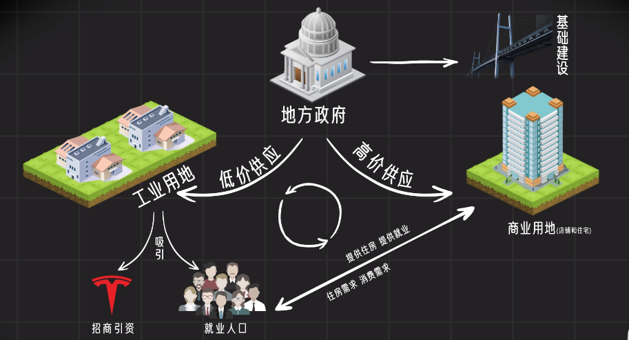
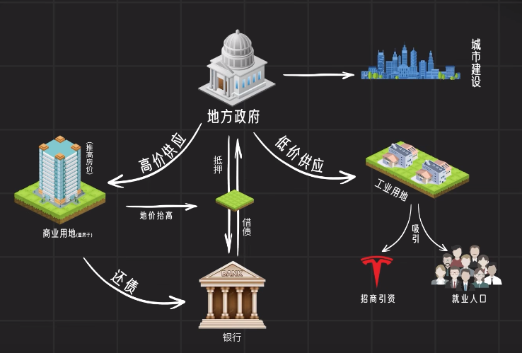
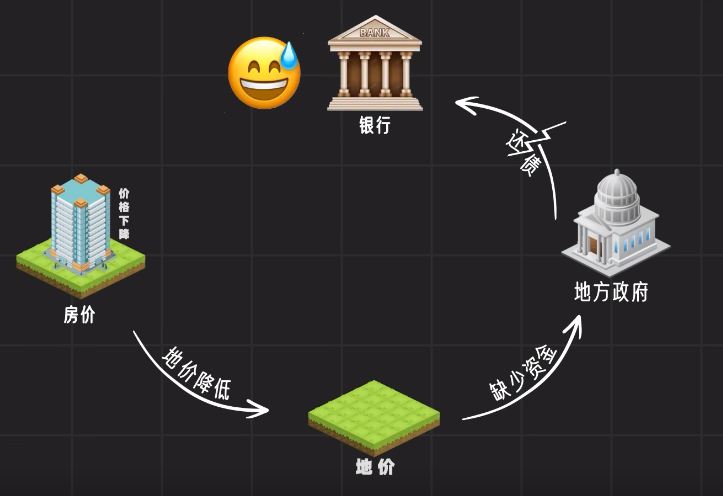

##  0.引言

- [文字转摘自](https://zhuanlan.zhihu.com/p/544876331)
- [视频查看](https://www.bilibili.com/video/BV1PB4y1h71p/?spm_id_from=333.788&vd_source=c257c862fc557490697db3d253b7e4c6)

##  1.背景历史

记得上学那会儿，政治课本上有个小故事，很经典。

说的是中美两国一对老太太死后在天堂门口相遇。美国老太太说，我年轻时候贷款买了一套大house，死前一天终于把贷款给还清了，哎呀妈，果然无债一身轻啊，你瞧我这都飘到天上来了。

中国老太太说，我省吃俭用存了一辈子钱，死前一天终于存够买了一套两室一厅，这才刚准备装修呢，咋就把我带上来了。不行，头七我得回去看看，不然装修队肯定偷工减料。

当时这个故事对我幼小的心灵冲击很大，可以说直接颠覆了九年义务教育建立起的朴素价值观，原来世界上还有这种活法。当时就想，长大后可千万不能活成中国老太太那样，太不值了，早买早享受，晚买……儿孙早享受。

我相信，这个故事肯定给无数中国小孩种下了超前消费的种子，现在网贷这么发达，它至少有一半功劳。

不过这个小故事最近这些年看已经过时了，得改一下。

中国老太太站在天堂门口，望着脚下的人间，欣慰地说：哎呀，存了一辈子钱，死前终于给孩子攒够了首付，也算是圆满了。

说完，一脸幸福地走进了天堂。

而世间的人们依旧匆匆忙忙。

天下熙熙皆为买房，天下攘攘皆为还贷。

大家好，我是九筒。上期视频我们说到九十年代初，中央财政枯竭，国库空虚，情急之下，国家果断推行分税制改革，挽救了这场财政危机。

然而谁也没想到，一场财税改革，无意中开启了潘多拉魔盒，放出一只凶猛巨兽，它的名字叫：

##  2.土地财政

过去二十年，这只巨兽拉着中国这架马车，狂飙突进，所向披靡，一路把中国拉到世界第二大经济体的位置。与此同时，这股摧枯拉朽的力量一路上也造成了很多破坏。

接下来我会花一期视频，将这二十年土地财政的来龙去脉、功过得失，好好来捋一捋。

这个视频真的可以说，不看不是中国人。因为作为中国人，我们都想搞清楚，房价为什么这么高？我们为了买房每天累死累活，到底是为谁辛苦为谁忙？

本期内容一部分还是源于这本书《置身事内》，同时我也参考了很多其他论文和资料，到时候都会附在视频结尾，对这个话题感兴趣的朋友可以去看看。

学术界对于土地财政的研究还是挺多的，算是经济学领域最热门的研究对象了，其中有些观点还挺冲击我们普通人的认知，不过好在人家是学术论文，我们普通观众扛着键盘都找不到地方去骂，毕竟知网会员比大会员可贵多了。

好了，闲话扯完，进入正题。

---------------

**首先，我们得弄清楚，土地财政是怎么来的？
** 

1994年分税制改革，重新分了蛋糕，中央财政危机确实得到缓解，但是随后地方财政又囊中羞涩起来。财权层层上收，事权层层下压，地方政府表示，我太难了。

尤其处在改革开放前沿的深圳，还要背负着赶超亚洲四小龙的重任。

至于怎么赶？自己看着办。

反正就是，要钱没有，要命…要政策，可以给。

说白了就是，用爱发电。

怎么发呢？

深圳领导在办公室背着手来回踱步，左思右想，然后走到窗前，把目光投向了河对岸的四小龙之一，香港。

黑夜中，领导看到一块石头闪着金光，定睛一看，那块石头上写着六个大字：土地批租制度。

由于历史原因，过去的香港政府很长时间一直通过向外租地挣钱，土地批租收入一度是香港政府重要的财政来源。

大陆一看，这是个好方法，于是以深圳为试点，摸着香港这块石头，展开了土地使用制度的改革。

首先，法理上要理顺。

我国宪法第十条规定，城市土地归国家所有，农村土地归集体所有。

我国的土地性质决定了土地所有权是不能买卖的。

1988年，宪法修正案对第十条重新解释，将土地所有权和使用权分开，所有权还是公有，不能转让，但使用权可以依照法律规定转让。

1990年，我国又相继出台了《出让国有土地使用权审批管理暂行规定》、《城镇国有土地使用权出让和转让暂行条例》等一系列法规法规，详细规定了土地使用权出让、出租、抵押等各项细节问题。比如规定住宅用地的使用权年限为70年，商业用地50年，工业用地40年。

至此，土地财政在法理上算是铺平了道路。各级地方政府蓄势待发，就等一声枪响。

1998年7月3日，这声发令枪终于打响。

当天国务院发布《关于进一步深化城镇住房制度改革，加快住房建设的通知》，决定停止单位福利分房，逐步施行住房供给商品化，住房分配货币化。此举标志着在中国沿袭了近50年的福利分房制度正式画上句号，房地产行业自此进入市场化阶段。

这就是著名的98房改。

之后，中国的房地产就像一匹脱肛的野马，裹挟一切，一路狂奔。

二十年来，我们的耳边只有一种声音

##  3.风声

房地产市场化后，我们来看看土地出让金收入增长情况。

1999年514亿
2004年6412亿
2013年41200亿
2021年87051亿

不知道的还以为这是一张火箭发射轨迹图呢。

再来看看近些年全国各大城市土地财政依赖度排名（土地财政依赖度=土地出让金收入/财政预算收入），杭州、佛山、南京、武汉，勇夺前四，依赖度超过120%，另外还有13个城市超过100%。

所以，这些年土地财政着实成了一只现金牛，各地政府趴上去一吸就停不下来，使命嘬，都快嘬出血了。

这时候灵魂拷问来了：

卖地挣钱吗？挣。
卖地赚钱吗？不赚。

别看地方政府一年卖地动不动几百亿上千亿的，挣得多，花的也多啊。

套用某个不能提名字的人话说就是，你卖了几百亿上千亿，那钱就是你的吗？不是你的，那只是老百姓相信你能把这钱用好，暂时让你保管。最终，你还是要把这钱花出去造福社会的。

地方政府卖的地类型主要可以分为两大块，一个是商住用地，一个是工业用地。

商住用地就是我们熟悉的商业和住宅，工业用地是给制造业建厂用的。

一般这种类型的地政府会以极低价格出售，为的就是招商引资。比如上海在南汇卖了一块地给特斯拉建厂，86万平方米，你们猜多少钱？

10个小目标就可以拿下。

平均每平米不到一千块，相比较上海十几万一平的房价，这简直就是白菜价啊。地方政府表示，卖地真的不赚钱，就是交个朋友。

不仅如此，工业用地卖出去后政府还要负责基础设施建设，通水通电通气通网，也就是所谓的“七通一平”。你得把屋子打扫干净再请客，这样人家企业才愿意来。

当然，你说你就不打扫，也行，有的是其他地方抢着打扫。最终结果就是，企业不来你们这，你们当地经济发展不行，最后GDP上不去。

GDP上不去，你人也就上不去。

这就是土地财政极速膨胀的第二层原因，政治激励。

改革开放后，全国人民达成共识，发展才是硬道理，团结一致向钱看，对地方官员考核的主要指标就是GDP，因此每个地方执政者都有发展经济的强烈冲动，地方政府之间纷纷展开了GDP竞赛。

路数也都差不多。

首先低价供应大量工业用地，用来招商引资，入驻的企业多了，税收就多，就业人口也就更多，人口多了消费和住房需求也就上来了。这时候再高价供应商住用地，让开发商建住宅，人越多房价就越高，房价越贵，地价涨得就越猛，地方财政也就越富裕，地方政府再用这个钱去搞基建，出台优惠税收政策，吸引更多企业入驻，更多企业带来更多就业人口，更多人口将房价推向更更高。

哎，经济就这样正向循环起来了，不断增长。

这就是我们过去二十年经济发展的内在逻辑。

一手低价供应工业用地，招商引资，创造税收和就业；一手高价供应商住用地，获得卖地收入，填补财政空缺。

工业化和城市化两手抓，两手都要硬。双赢，赢两次，赢麻了。

但是，光靠卖地这点收入，发展还是太慢，根本撑不起那些年我们GDP年均10%的增长率，修路搭桥、高铁机场，这些都需要天量资金，卖地那点钱，杯水车薪。

所以土地财政只是表象，我们这二十年经济发展的终极奥秘，其实是

##  4.土地金融

我们知道，个人创业最大的难题就是，你的启动资金从哪来？

同样，国家发展经济也会遇到相同问题，你的原始积累从哪来？

现在是文明世界，也不可能去抢。

我国在工业化初期通过工农业剪刀差，将农业积累转移到工业部门，从而奠定了初步的工业基础。

但接下来大规模的工业化和城市化，需要天量资本，这时候靠农民面朝黄土背朝天在泥土里一点点抠肯定是不行了，就算把农业一剪没了也支持不动。

没资本怎么办？

那只能向银行借了。

但向银行贷款首先要解决的就是信用问题，你得有抵押物。刚好土地动不了也偷不走，天然就是最好的抵押物。

于是地方政府和开发商用土地做抵押，贷出巨量资本，随后这些资本变成一座座高楼拔地而起。

从宏观层面来说，土地本来就是国家的，银行的钱也是国家印的，所以用国家的土地做抵押向国家借钱，本质就是以土地为信用基础发行货币，这时候土地就成了人民币的锚。

这就是土地金融的本质，将土地变成了融资工具，凭空创造出天量资本。

当然，也不是凭空了，我们向银行贷款，本质是向我们的未来借钱。房地产开发商抵押的未来是房价不断上涨，城投公司抵押的未来是城市越来越繁荣。

大家都是以梦为马，策马奔腾活得潇潇洒洒。

这就是土地金融的魔力所在，打破时间和空间限制，将未来贴现到当下，使其价值暴增，创造巨量原始积累，从而快速推进工业化和城市化。

这就跟公司上市融资的逻辑差不多。一家公司上市后通过发行股票融资，股民如果看好这家公司的未来，就买它的股票，越多人看好，股价就被抬得越高。

理解了这点，我们再回过头看98房改，其实那一次就相当于中国各个城市集体IPO，不过发行的不是股票，而是房子。

过去二十年，你买了哪个城市的房子，就相当于投资了那个城市的股票。城市发展越好，股票价格就越高，对应的也就是房价越高。

这也解释了中国经济最大的一个谜题。

为什么最近几十年中国经济飞速发展，然而中国股市却不动如山，坚如磐石。

老韭民都知道，我们的大A股有个魔咒般的数字，3000点！每隔几年就要来一次3千点保卫战。

问题出在哪了？不是说股市是经济的晴雨表吗？这怎么动不动五雷轰顶呢？

现在说通了，其实股市只是配角，楼市才是中国经济真正的晴雨表。

如果你把不同城市的房价视作该城市的股价，就会发现这个股价的增长和中国经济的增长完全一致。

目前，中国楼市总市值大概65万亿美元，这个规模刚好跟美国股市相当，再加上一个日本债市，哥仨并称为全球资本市场三大奇迹、世界上最硬的三大资产、东西方永远不败的三大神话。

山无棱天地合，楼债股也不可破。

不过最近日本债市有点要泄气的意思。算了，先不管它了。

所以说，在我们这个国家一穷二白的时候，土地金融制度帮助我们以前所未有的速度积累起原始资本，随后又将资本变成一幢幢高楼、一座座工厂，一条条道路和桥梁，最终我们用短短三十年就完成了工业化和城市化。

这无疑是一个经济上的奇迹。
然而，命运所有的馈赠，暗中都早已标好了价格。

面对如今拥有的这一切，我们还是要问一句：那么，狗蛋

代价是什么呢？

对我们个体来说，最直接的体会当然就是高房价了，买一套房要掏空6个钱包，这谁顶得住。当6个钱包都不够时，那就只好躺平。低欲望社会就是这么躺出来的。

其次在社会层面，高房价拉大了贫富差距。先买房的人靠房产升值完成了个人的财富积累，实现阶层跃升，后来者再想上车就难了。

有人吃着12元的鸭仔饭，有人手里有10栋楼收租，大家都过着幸福的生活。

从宏观层面来看，土地财政虽然强有力地拉动了经济发展，但拉到一定程度后，就会对各行各业造成严重的挤出效应，尤其是制造业，因为它占据了大量社会资源。每次国家放水，全都被房地产一个行业吸去了，那其他行业还怎么发展？

最后就变成，旱的旱死，涝的涝死。

以上说的这些都是结构性问题，需要很长时间去调整，这里就不展开讲了。

眼下还有一个更紧迫的问题：

##  6.地方债务

截至今年5月末，全国地方政府债务余额33万亿，城投债存量14万亿，加起来将近50万亿。如果按照3%的年利率计算，每年光支付利息就要1.5万亿，可想而知地方政府的偿债压力有多大。

为什么会出现这么多债？

我们知道，地方政府借的债都是搞基建去了，而基建最大的特点就是，投资大、利润低、回报周期长。

比如地铁一公里造价10个亿，而我们坐一趟地铁票价才几块钱，这得卖到猴年马月才能赚回来，目前国内就没有哪个城市的地铁回本了。

但为什么还不断有新城市砸锅卖铁也要修地铁呢，因为它带来的社会效益是巨大的。而且还倍有面子，你不能说我省会城市连个地铁都没有吧。

听到这，海口骂骂咧咧地退出了视频。

所以地方政府搞建设那都是为了公共福利，提赚钱就俗了。

当然，银行表示，你不赚钱可以，但你欠我们的债一分也不能少。

那地方政府靠什么还债呢？只能是卖地了。

还记得我们前面说的经济发展闭环吗？

地方政府用土地做抵押向银行借债，搞城市建设，同时一手低价卖工业用地招商引资，吸引就业人口，一手高价卖商住用地，盖房子，推高房价。房价一高，地价也随之水涨船高，这样溢出的收益就可以还银行的债，然后下一轮用更高地价撬动更多的债。就这样不断循环。

大家发现了没，这套经济永动机的核心动力就是——房价。

房价一旦下跌，地价就得跌，地价跌，地方政府就没钱还债，没钱还债，银行就急了。

所以说，地根连着银根。

现在大家能理解为什么各地纷纷出台房价限跌令了吧。

不是不想给你便宜，是这个价真的进都进不来啊。

中国老百姓80%的资产在房子上，地方政府80%的负债需要靠卖地偿还，这能大跌吗？

往小了说，这是身家。往大了说，这就是国运。

君国大事，我们老百姓还是谅解一下吧。

一代人有一代人的岁月静好，一代人也有一代人的负重前行。

当然，如果一直这么负重下去，有没有下一代就不好说了。

所以最近几年，国家已经开始着手减负计划。

而这其中最紧迫的任务就是

##  7.去杠杆

这也是十九大报告里提出的三大攻坚战之首——防范化解重大风险。

前年国家出台了房地产行业三道红线，要求到2023年底，所有房企必须达到剔除预收款项后资产负债率不超过70%、净负债率不超过100%、现金短债比不得小于1倍。

三道红线重点针对的就是“高融资、高负债、高杠杆”的三高房企。

前些年，中国房企负债率一个个高到离谱，别说百分之一百了，百分之两百、三百的都有。
真正做到人有多大胆，地有多杠杆。

房企老板们表示，给我一个杠杆，我能开发整个地球。

所以那些年，很多房企老板们错把时代的红利当成自己的能力，以为站在城楼上拍张照，就真的上天了。

国家出台三道红线，目的就是要勒一勒房企老板们的爱马仕裤腰带。

不过最近来看，好像稍微勒高了点，勒到了脖子。

所以最近又有松一松的迹象，让他们喘口气。

但我相信，这只是暂时的技术性调整，一旦大环境回暖，还是得继续勒下去。

这个过程肯定得有一定弹性，勒紧了影响宏观经济，勒松了会反弹，所以得讲究个一张一弛。

中间可能有反复，但是时代大势是不会变的。

这个大势就是，房地产终将退出历史舞台。

因为基本面已经发生变化，短期经济转型的迫切，中期城市化见顶，长期人口老龄化严重，这三个大逻辑的转变让房地产不退也得退。

现在我们要做的就是，怎么帮它体面地退。

因为我国的房地产就像一只飞在空中的大气球，我们不能把它一下刺破，否则就是一颗金融核弹，现在唯一能做的就是不再给它吹气，同时把脚下这块经济陆地一点点码高，它慢慢往下飘，我们的经济逐步往上升，最终实现双向奔赴。

这是个漫长的过程，期间肯定会有很多转型期的阵痛，但这，是我们必须要承受的。

##  8.凡事皆有代价。

虽然现在很多人大力批判土地财政，但从历史角度看，中国在工业化和城市化初期，一穷二白，除了土地财政，你找不出第二条高速发展的道路。

这是历史的选择。

当我们回顾任何一段历史的时候，读出了“不得已”三个字，说明你已经接近历史的真相。

当然，这并不意味着我们可以忽视它带来的问题。所以改革只有进行时，没有完成时。

那么新的问题又来了。

当有一天，土地财政真的走到了终点，谁又将加冕为新王呢？

敬请期待下期视频：开征吧！房产税