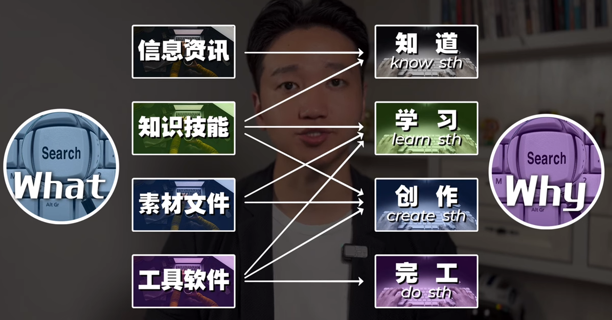
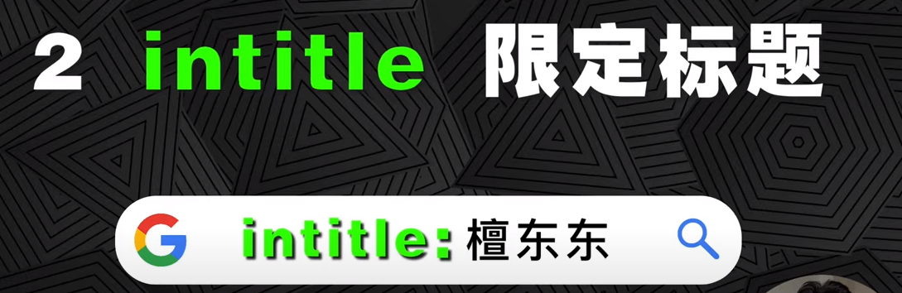
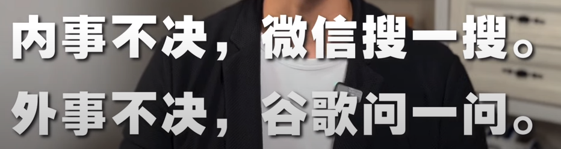

##  0.引言

- [这个视频的笔记](https://www.youtube.com/watch?v=tiN6T1LewmQ&t=793s)

  

  

  

  

##  1.去哪儿搜&怎么搜

###  1.1.信息资讯搜索

  

  

- 微信搜一搜，手机端使用
- [搜狗搜微信](https://weixin.sogou.com/)
- [搜狗搜索](https://www.sogou.com/)
- [百度](https://www.baidu.com/)
- [google Chrome](https://www.google.com/)
- 有些信息在[小红书上搜索](https://www.xiaohongshu.com/explore)结果也很棒，好像得登录才行

###  1.2.chrome 使用语法

- "" 限定关键词

  

- intitle: 限定标题

  

- 以上两个语法的组合

  

- allintitle: 限定标题多个关键词

  

- intext: 限定内容关键词

  

  

  

  

  

- inurl: 限定网址关键词
- site: 限定网址

  

  

  

  

- site:199it.com  (发布报告的网址)

  

  

  

- imagesize: 限定图片尺寸

  

  

- filetype 限定文件格式：ppt、xls、png、pdf、gif、SVG

  

  

- 小结：  ""、 intitle、allintitle、intext、inurl、site、imagesize、filetype

  

==直奔信息源头才能最大程度的保证信息的准确性，第一性原理==

- eg:花西子成分：国家普通化妆品备案信息
- eg:产品参数：电商平台查找

  

###  1.3.知识技能搜索

知识存储地点：
- 组织内部：同事电脑、聊天记录、公司内部知识库
- 组织外部：网页、电子书、电子文档、学术论文、笔记Apps、知识平台Apps、视频网站Apps、Ai大脑ChatGPT、牛人大脑
  - 蹭会议涨知识
  - 群文件扫盲
  - 搜索后请教

- 国内：

  

  

  

- 国外：

谷歌图书、谷歌学术、wiki、Udemy、EDX、coursera、 wolfram、Khan Academy可汗学院、youtube、Duolingo、...

  

近些年中文文本的文章主要沉淀在公众号和知乎文章里面，此时就可以使用搜狗搜索；腾讯的生态也比较封闭，谷歌搜索不到公众号文章。

  

- 聚合网址：  GitHub、Stack Overflow、CSDN、产品经理导航网址、设计师导航网址、新媒体导航网址

  

  

- 报告相关的网站查找

  

- 一个很厉害的小工具： [SimilarSites,查找相似的网站](https://www.similarsites.com/)

  

  

- 论文下载
  -  国内：淘宝买一个知网账号
  -  国外：

  

- 电子书下载
  - 中文：鸠摩搜书
  - 国际：[best free ebook download sites](https://www.google.com/search?q=best+free+ebook+download+sites&oq=best+free+ebook+download+sites&aqs=chrome..69i57j0i7i30j0i30l3j0i5i30.17664j0j4&sourceid=chrome&ie=UTF-8): z-library、manybooks、pdfbooksworlds

  

- 电子书App

  

说实话我没咋听过“得到”App，总感觉是软广告！

- 视频类：[best online learning websites](https://www.google.com/search?q=best+online+learning+websites&sca_esv=577441552&sxsrf=AM9HkKnddGTOzzIfzzrdBHbOEoV6nKaJfQ%3A1698498110009&ei=PgY9ZZUZ85qO4w_N7pOoAQ&ved=0ahUKEwiVsP7D5piCAxVzjWMGHU33BBUQ4dUDCBA&uact=5&oq=best+online+learning+websites&gs_lp=Egxnd3Mtd2l6LXNlcnAiHWJlc3Qgb25saW5lIGxlYXJuaW5nIHdlYnNpdGVzMgUQABiABDIEEAAYHjIGEAAYCBgeMgYQABgIGB4yBhAAGAgYHjIGEAAYCBgeMgYQABgIGB4yBhAAGAgYHjIGEAAYCBgeMggQABgIGB4YD0jPEVDRC1jRC3ABeAGQAQCYAasBoAGrAaoBAzAuMbgBA8gBAPgBAcICChAAGEcY1gQYsAPiAwQYACBBiAYBkAYK&sclient=gws-wiz-serp)

  

- [网盘搜索](https://www.google.com/search?q=%E7%99%BE%E5%BA%A6%E7%BD%91%E7%9B%98%E6%90%9C%E7%B4%A2%E5%BC%95%E6%93%8E&sca_esv=577441552&sxsrf=AM9HkKkmoLVsvwW11IuV6GmYG32Zzofx-A%3A1698498115419&ei=QwY9ZbaKGZmJ4-EPtLqY8Ac&oq=baiduwangpansousu&gs_lp=Egxnd3Mtd2l6LXNlcnAiEWJhaWR1d2FuZ3BhbnNvdXN1KgIIATIFEAAYgAQyBRAAGIAEMgUQABiABDIFEAAYgAQyBRAAGIAEMgUQABiABDIFEAAYgAQyBRAAGIAEMgUQABiABDIFEAAYgARIlzJQsgpY_CRwBHgBkAEBmAGlAqAB6BqqAQYwLjExLje4AQHIAQD4AQHCAgoQABhHGNYEGLADwgIHECMYigUYJ8ICBBAjGCfCAgcQABiKBRhDwgILEAAYgAQYsQMYgwHCAggQABiABBixA8ICDhAuGIAEGLEDGMcBGNEDwgIJEAAYigUYChhDwgIHEC4YigUYQ8ICERAuGIAEGLEDGIMBGMcBGNEDwgIFEC4YgATCAggQLhiABBixA8ICCxAAGIAEGLEDGLED4gMEGAAgQYgGAZAGCg&sclient=gws-wiz-serp#ip=1)

##  2.素材文件

- 视频：youtube、pexels、pixabay、videvo、mixkit；[best sites for free stock videos](https://www.google.com/search?q=best+sites+for+free+stock+videos&oq=best+sites+for+free+stock+videos&aqs=chrome..69i57.1035j0j9&sourceid=chrome&ie=UTF-8)

  

youtube视频下载，在网址前加"9x”；或者使用save.tube

- 音频：[best sites for free bgm](https://www.google.com/search?q=best+sites+for+free+bgm&oq=best+sites+for+free+bgm&aqs=chrome..69i57.882j0j9&sourceid=chrome&ie=UTF-8)、[royalty free BGM sites](https://www.google.com/search?q=royalty+free+BGM+sites&oq=royalty+free+BGM+sites&aqs=chrome..69i57.884j0j9&sourceid=chrome&ie=UTF-8)

- 图像：google直接搜、pexels、unsplash、pixabay、[gettyimages.com](https://www.gettyimages.com/)[Gettyimages Downloader下载](https://steptodown.com/getty-images-downloader/)
  - gif图：[best gif sites](https://www.google.com/search?q=best+gif+sites&oq=best+gif+sites&aqs=chrome..69i57.791j0j4&sourceid=chrome&ie=UTF-8)
  - icon：eg：[rocket icon filetypr:png](https://www.google.com/search?q=rocket+icon+filetypr%3Apng&oq=rocket+icon+filetypr%3Apng&aqs=chrome..69i57.851j0j9&sourceid=chrome&ie=UTF-8)、[iconfont.cn](https://www.iconfont.cn/)

- PPT：
  - islide插件
  -  [canva.com](https://www.canva.com/zh_cn/)

##  3.工具软件

  

- 在线
  - 海报设计：canva.com
  - 抠图：remove.bg
  - 文字转语音：腾讯智影、Azure
  - 脑图、概念图：miro、canva
  - 找台词：找台词网
  - 剪辑视频：Clipchamp、FlexClip
  - 测网速：fast.com
  - 检测陌生安全性：virustotal.com
  - 云计算：ChatGPT、midjourney

  

- 平时可以随意搜搜：
  - 2023 best apps、top 10 best mac apps productivity
  - [alternativeto.net网站召新奇的软件](https://alternativeto.net/)

- 插件：
  - chrome插件：[best chrome extension productivity](https://www.google.com/search?q=best+chrome+extension+productivity&oq=best+chrome+extension+productivity&aqs=chrome..69i57j0i8i30l2.881j0j4&sourceid=chrome&ie=UTF-8)
  - 软件插件：best PowerPoint Plugin 、 best premiere plugin

  

小结：

  

