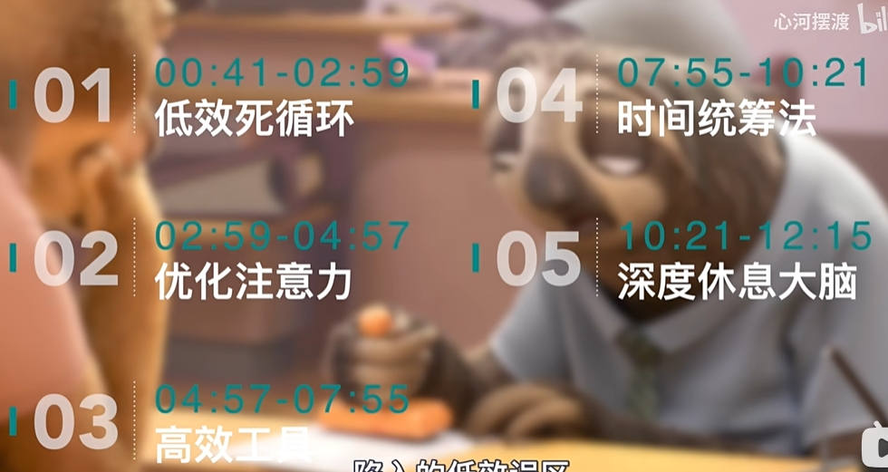
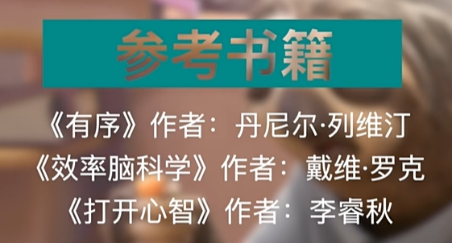
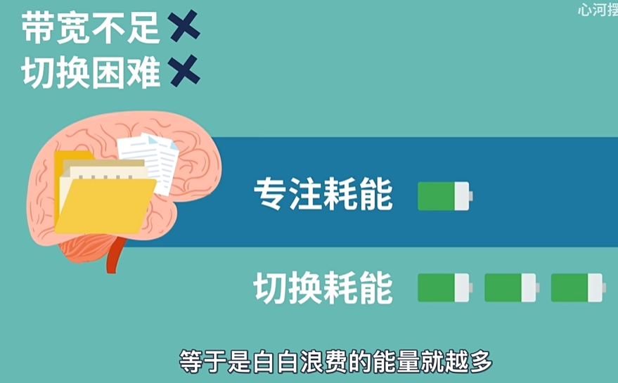
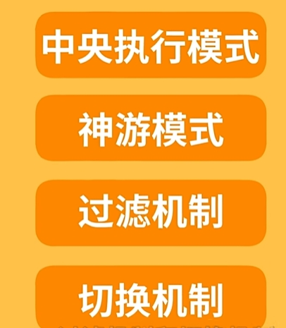
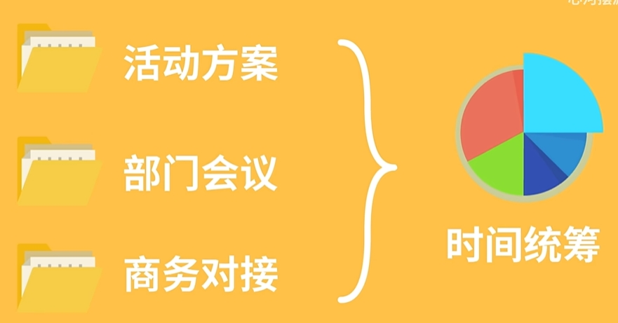
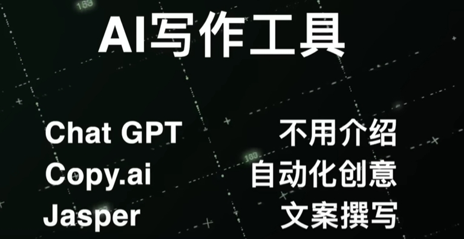
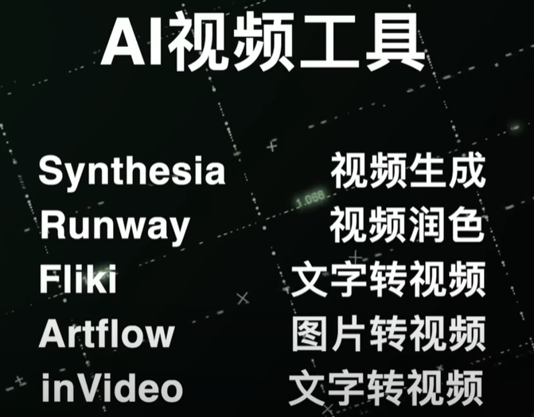
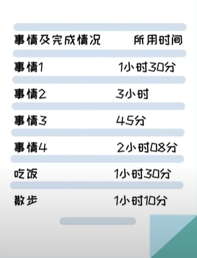
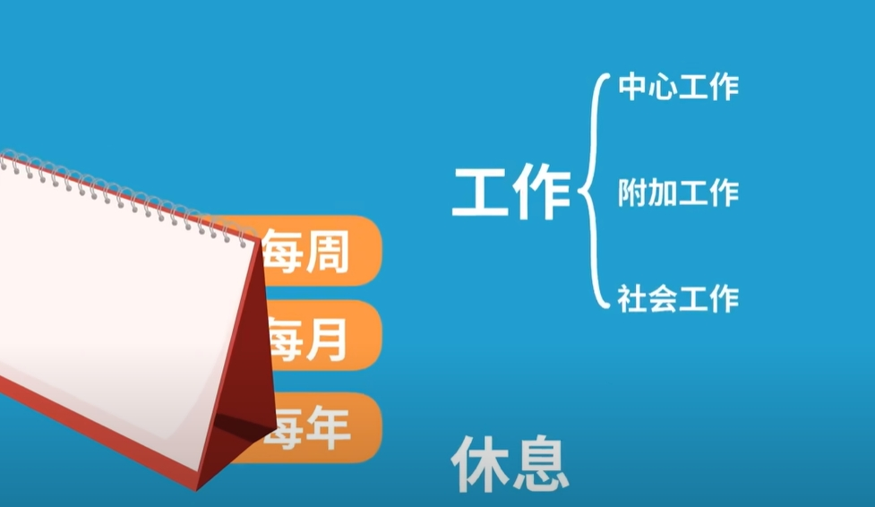
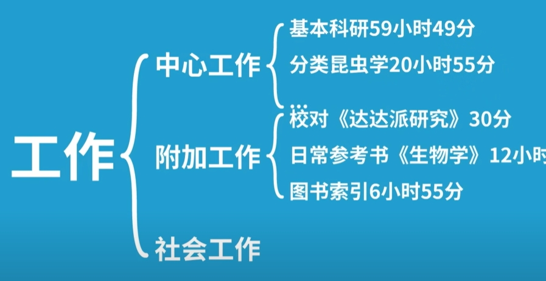

##  0.引言

- [本文档为该视频的笔记](https://www.youtube.com/watch?v=RyCL5BDuG7k)

  

  

##  1.低效死循环

- 开启多任务模式，一边写稿一边剪辑，又是拉长工作时间，能多干半小时，却不早睡一分钟，最后成功把自己的效率又降了一档，都不知道自己是怎么做到，看上去日里万鸡，实际上啥也没干的。

- 同时处理多项任务，可行吗？
    - 实际上大脑无法同时处理多个任务，只能一个一个的来。比如，同时做ab两件事，也是先处理a再处理b，然后又回过头来处理a，本质上跟做完了a在做b是没有区别的。倒不是大脑不给力，而是注意力不争气。因为它有两个缺点：
    - 首先是**带宽不足**，同一时间只能允许少量信息进入大脑，一旦超出负荷，就得把之前的信息清除后再重新写入。就好比电脑各项配置都拉满了，结果内存只有两个g，你干着急也打不了游戏。
    - 第二个是**切换困难**，当我们不停的切换任务时，比如从a切换到b，会残留一部分a继续占用我们的脑力资源，导致处理b的资源减少，这叫做注意残留，所以理论上每次切换效率都会降低一些。另外，大脑切换任务也需要消耗能量，而且一点也不比专注时低，切换的次数越多，等于是白白浪费的能量就越多。就像我妈经常说的，空调一开一关也费电，所以你就别开了

  

- 那死磕时间能弥补低效吗？效率不够时间来凑？你会发现专注一分钟很简单，但要专注一个小时就困难。

- 注意力系统有四个部分组成：中央执行模式、神油模式、过滤机制和切换机制

    

    
    

    - 专注一件事实际上是开启了中央执行模式，这个时候过滤机制也在工作，避免外界信息的干扰，抑制跟当前任务无关的思维活动，随着时间推移，过滤机制效应减弱，一些动静和念头就不受控制的流进大脑。人也从中央执行模式变成了神游模式，俗称走神
    - 如果把大脑处理任务的过程看成是工厂生产的过程。咱们就知道该如何提升效率了。大脑就是工厂，注意力是大门，要做的事就是输送原材料的车辆。提高效率，不妨从这四个方面来考虑：

        

        
        

        - 第一是调整大门的进出机制，只让原材料车辆进出。-->**优化注意力**
        - 第二是安排人疏导交通，让大车，陌生车也能顺利进入。-->**效率工具**
        - 第三是统计每辆车的货量和速度，规划各自的进出时间。-->**时间统筹**
        - 第四是定期检修工厂设备，让生产力始终保持高效。-->**休息大脑**
        
        
 
##  2.优化注意力

只要一项任务需要有意识的思维所谓活动，都要经过理解、存储、调取、抑制和决策五个步骤。每个步骤都需要大量调用前额液体质，当然也需要大量消耗注意力等脑力资源。这就是为什么咱们一上午都坐在工位上或者教室里，屁股都没动一下，下午还是会犯困，所以优化注意力的：

- 第一个方法就是**减少耗能**。能不用就不用，能少用就不多用，在工厂大门贴个告示，输送原材料的车可以进，其他闲杂车辆不能进。大家也能发现，即便我们没在工作学习，手机消息，娱乐节目，商业广告也无时无刻不再抢夺我们的注意力；没办法，生物进化给我们的注意力资源就这么多，远远跟不上信息爆炸的速度，所以不能雨露均沾，只能合理分配：关闭手机弹窗消息、刷的新闻不带入情绪、看到广告不纠结需不需要...也不是说完全屏蔽这些信息，只是少浏览、浅浏览，因为无处不在的被动关注才是注意力的最大黑洞。

你可能会纳闷，刷手机不是休息吗，其实刷手机是大脑处于神游模式，可别小看这种漫无目的的状态，它的耗能占大脑总耗能的60%~80%比专注时还高，相当于是你什么都没干，
大脑还在高速空转。

- 第二个方法是**注意力外包**。把一部分注意力转移出去，帮大脑减负，就像老板的秘书、明星的经纪人、我们的**清单**。只希望把要做的事记下来就好了，当你的事比较多的时候，你去做其中一件就会发现，其他事也会时不时的冒出来骚扰你一下，这叫做**侵入式思维**，所以你很难保持百分之百的专注，现在**把这些任务写下来**，他们就不再占用你的脑力资源，一来排出了侵入式思维的干扰；二来也释放了有限的脑力空间，效率自然就提高了。

除此之外，它还是咱们后面要提到的时间统筹的基础，这里就先卖个关子。

##  3.高效工具

碰到比较复杂或者需要创造力的工作，效率就由不得我们自己了，就像是工厂外来了一些大型车、陌生车，门小路绕，怎么都进不来。增加知识储备，虽然能解决问题，但学知识毕竟是个长期积累的过程，阔门修路怎么也得十天半月对吧，当下问题要当下解决的话咱们就得找找捷径，安排个指挥员疏导交通。**《有序》**这本书称之为训练信息素养：就是**面对一个问题，你不需要把所有相关的知识都学会，而是有快速获取和运用知识的能力。**

举个例子，谷歌面试员工喜欢问一些奇葩问题，帝国大厦的重量是多少？咱总不能先去学建筑学知识再去帝国大厦测量吧，所以他们的目的不是答案，而是解题思路，就是得清楚需要获取哪些关键信息，这就是信息素养，它的关键是学会发现并使用有效工具及时打破信息差。以前我写稿思维枯竭的时候就只能坐那干耗着，而且是越急越憋不出来，但有一次我用了ai后才发现自己走了太多弯路，很多问题真的有一步到位的捷径，通过搜索就可以立马得到想要的答案。

像平常一些超出认知范围的，需要创造性思维的，自己做太耗时的事情都可以交给ai，我们只需要判断获取信息的相关性和专业性，然后在这个基础上形成自己的方案就可以了，当有了一定的信息素养，你会发现它就像杠杆一样，那些原本比较困难的事咱们也能轻松驾驭。

##  4.时间统筹法

时间统筹应该怎么做？先给大家介绍一位大神流比歇夫，他有多牛呢，一生发表了70多篇学术著作，包括分散分析、生物分类、昆虫学、农业、遗传学、进化论等。各种论文、专注500多印章；相当于12500页打字稿，搜集昆虫标本13000，只一个人收集的材料是整个动物研究所的五倍。就这，还利用业余时间自学了英语、俄语和法语，我都怀疑这老爷子是不是每天不吃饭不睡觉，不停的工作。但事实上，人家每天睡十个小时，心情好了还去看戏剧，听音乐会，而这一切都是因为他独特的时间统筹方法。跟其他时间管理法又是长篇大论又是借助工具不同，流比歇夫的方法只有三步： **记录、总结和决策**：

- **记录** 就是前面提到的清单，不过除了做的事情，还要把完成情况和所用的时长记下来。可不要小看这个流水账，用了之后，你会发现这才是真正的你管理时间，而不是让时间来管理你。

什么时候做，做多久都由你决定，他抢到了一个掌控权，这个方法流比歇夫坚持了56年，他甚至把吃饭，散步这些零散时间也做了结论，这样一来，所有时间都不会凭空消失，变成了什么都有机可循，记录的目的是为了总结。

- **总结**：流比歇夫每周、每月、每年都会对每天的时间记录进行总结，然后根据任务性质分类，比如整体分成工作和休息；工作，又分成主线和支线

，最后再对重点工作进行细分，整理完之后，他就知道，哪些些事花费时间比较多，哪些事效率比较低，以此作为参考进行时间优化

- **决策** 是根据总结分析的结果得出最高效，也最适合自己的行为准则，流比歇夫就根据各种事的特征见缝插针，比如散步的时候捕捉昆虫，在无聊的会议上算数学题，出差提前寄出大部头的书籍。就感觉他老人家把所有的时间都利用到了极致，而且完全是沉浸在自己的世界里，不紧不慢，却有效率提高。

用这个方法来管理时间，我们就不用被时间追着跑，而是根据自己的习惯和效率来分配任务和时间，最后再根据实际情况慢慢优化，大脑这家伙吃软不吃硬，这种循序渐进的方法，他更容易接受，所以更容易坚持下来，形成习惯。

##  5.深度休息大脑

这里的深度休息并不是休息身体，而是**休息大脑**。再具体一点是**休息前额叶皮质**，前面也提到有意识的思维活动都会大量使用前额叶皮质,所以，只有让他深度休息，才能真正的恢复状态，保持高效，这里有两个方法:

- 第一个**心流活动**。流活动心流其实是一个人高度专注某件事时的心理状态，就好比你打游戏太投入了，你以为只过了一会儿，结果抬头一看，天都黑了。**心理学家发现心流状态下，前额叶皮质的大部分活动会停滞，只保留一小部分专注当下，所以耗能很低。**另外，在心流过程中，大脑会分泌多巴胺、内啡肽、内肥肽，去甲肾上腺素等激素，辅助提升状态。生活中容易带来心流的体验有三类：

    - a.竞技类，比如下棋，打游戏或者一些竞技类运动
    - b.创造类，比如作曲，绘画，舞蹈写作
    - c.眩晕类，比如游乐场里的一些刺激项目，过山车，大摆锤之类的。
    
    你可以选择适合自己的，为了更容易进入行流状态，这些方法最好符合几个原则：

    - a.一定是自己感兴趣的
    - b.开始前先清除一些干扰，比如手机铃声
    - c.稍微有些挑战但又不至于太难
    - d.不要太耗费体力，不然大脑恢复了身体又累

- 第二个**正念**，呼吸正念可以开启大脑的低耗能模式，还能帮你减轻压力，提高专注力和记忆力。有些小伙伴可能会觉得困难，咱们只需要记住一句话就行了，找个舒服的姿势坐着或者躺着。把注意力集中在平稳的呼吸上，如果走神了，就以呼吸为锚点，在心里默数呼吸的次数把思绪拉回来，每次5-10分钟就可以了，刚开始坐不住也没关系，多试几次就习惯了。不过要注意，最好每天能在同一时间，同一地点进行，这样大脑适应得更快。

##  6.总结

有时候我也纳闷，我为什么要追求效率呢，又不是给别人打工，也没人催我敢进度，后来我发现提高效率不是为了做更多事挣更多钱，而是在完成必要的工作之后，还有足够的时间让自己慢下来，去放松自己，去陪陪家人，去享受生活。所以提高效率不是为了快，而是为了慢，快只是过程，慢才是目的；当我们没有时间和精力去体验慢的时候，再快也没有意义，最后希望大家都能高效一点也能慢一点。
